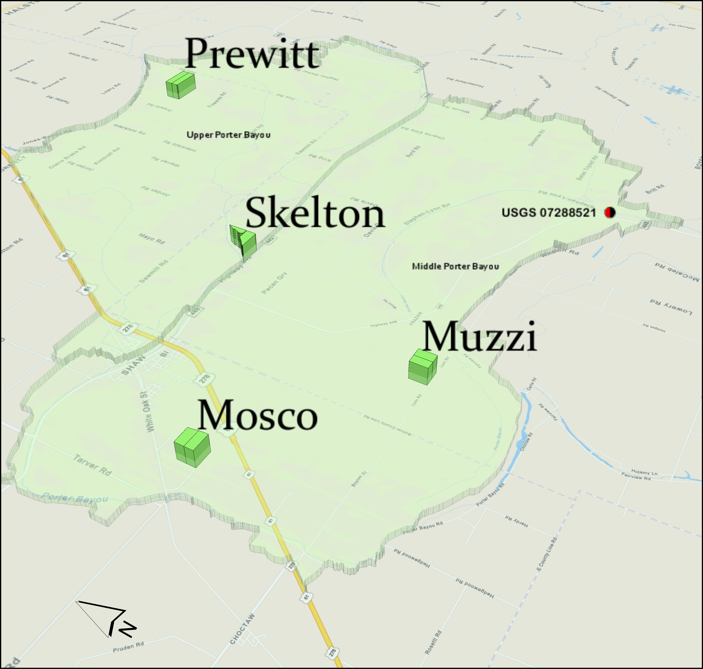

```{r setup, include=FALSE}
knitr::opts_chunk$set(echo = TRUE)
```

### Workflow  {-}
The data pipeline for the delta farm project was starting to become convoluted. It felt prudent to outline it somewhere so i decided to give it a shot in Rmarkdown. ;) Thanks Andrew.  
The work consists of four principal steps.  

 * Read In
 * Quality Assurance
 * Visualization
 * Analysis

The later steps may well be beyond the scope of this document. As such, i will reserve those for a later date.  
First we will call on our libraries to carry out subsequent functions.

```{r error=FALSE, message=FALSE, warning= FALSE}
library(lubridate)
library(tidyverse)
library(ggpubr)
library(zoo)
library(scales)
library(gridExtra)
library(grid)
library(mosaic)
library(knitr)
library(kableExtra)
library(mice)
library(patchwork)
```

Now we are ready to read in our data set which is stored as a csv. This data set includes, embedded in it, the QAQC checks carried out for sample analysis as well as sampling trip quality objectives outlined in the project QAPP.  

# Read In
So, lets give that csv a look.

```{r}
dat <- read.csv("DF_final.csv",
                stringsAsFactors = FALSE,
                na.strings = c("", "NA") 
) %>% 
mutate( 
    Date = lubridate::mdy(Date),
    sampleid = as.factor(sampleid),
    farm = as.factor(farm),
    treatment = as.factor(treatment),
    TUR_ntu = as.numeric(TUR_ntu),      
    sample_type = as.factor(sample_type)
  )

```

We pipe the data set to mutate so R will be sure to read the variables like we want them. This is the first touch of housekeeping.  
Now that we have a dataframe, what does it look like?

```{r}
str(dat)
```

Here we can see all the variables in the dataset. Though, we can see that they don't seem to follow a single style pattern. Lets fix that with a bit of code that will switch all the underscores to periods.

```{r}
names(dat) <- gsub(
  x = names(dat), 
  pattern = "\\_", 
  replacement = "."
)
```


Again, lets take a look at the structure just to make sure it's what we want.
```{r}
str(dat)
```

Later we will want to consider our data from a seasonal perspective given the nature of the treatment. Lets go ahead and add this variable to the data frame. I'll assign the season with an if~else statement then tidy up so R will undertand this factor in our analysis.

```{r}
dat$season <- ifelse(
  month(dat$Date) == 11 | month(dat$Date) ==  12 | month(dat$Date) == 1| 
    month(dat$Date) == 2 |  month(dat$Date) == 3 | month(dat$Date) == 4,
  "cover",
  "cash")

dat <- dat %>% 
  mutate(season = as.factor(season))
```
One last thing before we move on. With a scollable box we should be able to preview our dataframe.
```{r, out.width= "100%"}
kable(dat, "html", digits = 4) %>% 
  kable_paper() %>% 
  scroll_box(height = "600px")
```


# Quality Assurance
Next we want to evaluate all the controls we put in place to make sure our data is sound. These included labratory standards and standard operating procedures. If the minimum amount of quality objectives (80%) were not met for for each sampling trip the values will be dropped and not considered for analysis.   
    
## Standard checks 

First, we will evaluate the logical for the overall trip objectives.

```{r results='asis'}
conc <- c(10,11,13:15,17,19,21,23,25,27,31:39)
cat(paste0("`", names(dat[conc]), "`   "), sep = "", fill = TRUE)

for (i in conc) {
  dat[,i] <- ifelse(
    dat[,2] == FALSE,
    NA,
    dat[,i]
  )
}
```
This will replace concentration and load data in the above columns with "NA" where the logical in column "qaqc.check" equals "FALSE" for their respective records.  


After that we are going to evaluate the the labratory standards used during each analysis batch. Here the code looks to in the individual analytes and their respective logical checks. Generally this is in the neighboring column. The exception is the NO3.mgl column; this checks against the NOx.mgl standard.
```{r}
logic <- c(12, 16, 18, 20, 22, 24, 26)
for (i in logic) {
  dat[,i - 1] <- ifelse(
    dat[,i] == FALSE,
    NA,
    dat[,i - 1]
  )
}

dat[,27] <- ifelse(
  dat[,24] == FALSE,
  NA,
  dat[,27]
)
```

This step leaves us with a data set where any nutrient concentration values which don't meet our quality standard are omitted. This step is then repeated to omit loads which are associated with these omitted records.
```{r}
# replace tss loads
for (i in c(21, 24, 27)) { 
  dat[,10 + i] <- ifelse(
    is.na(dat[,10]) == TRUE,
    NA,
    dat[,10 + i]
  )
}
# replace tn loads
for (i in c(17, 20, 23)) { 
  dat[,15 + i] <- ifelse(
    is.na(dat[,15]) == TRUE,
    NA,
    dat[,15 + i]
  )
}
# replace tip loads
for (i in c(16, 19, 22)) { 
  dat[,17 + i] <- ifelse(
    is.na(dat[,17]) == TRUE,
    NA,
    dat[,17 + i]
  )
}
```
We then remove the logical columns in our next little bit of housekeeping.
```{r}
dat <- dat %>% 
  select(-c(2, 12, 16, 18, 20, 22, 24, 26))

rm(conc, i, logic)
```

## Impute missing values
Now that we have omitted values that were not up to our quality standards we will use a correlation method to impute those values missing from our data set.

Sediment bound and associated nutrients are grouped together.
```{r}
impdat <-
  mice(
    data = dat[,c(9, 10, 14)],
    m = 5,
    maxit = 50,
    method = 'pmm',
    seed = 1234,
    printFlag = FALSE
  )

set.seed(1234)  # set seed for random imputed dataset selection
compdat <- complete(impdat, round(runif(1, 1, 5), 0))
# randomly select imputed dataset and combine with complete dataset

# inspect imputed data
# imputed datasets in magenta; observed in blue. are values plausible?
#stripplot(impdat)
# do imputed points fall in likely area of distrib.?

dat[,c(9, 10, 14)] <- compdat[,1:ncol(compdat)]
```
Orthophosphate is grouped with Total Inorganic Phosphorus
```{r}
impdat <-
  mice(
    data = dat[,c(14, 16)],
    m = 5,
    maxit = 50,
    method = 'pmm',
    seed = 1234,
    printFlag = FALSE
  )

set.seed(1234)  # set seed for random imputed dataset selection
compdat <- complete(impdat, round(runif(1, 1, 5), 0))
# randomly select imputed dataset and combine with complete dataset

# inspect imputed data
# imputed datasets in magenta; observed in blue. are values plausible?
#stripplot(impdat)
# do imputed points fall in likely area of distrib.?

dat[,c(14, 16)] <- compdat[,1:ncol(compdat)]
```
Nitrogen and associated complexes grouped together.
```{r}

#PerformanceAnalytics::chart.Correlation(dat[,c(11:13, 15, 17:19)])
#PerformanceAnalytics::chart.Correlation(dat[,c(11:12, 15, 17)])
# NO3NO2 - NOx - NO3
# TKN - TN
# NH3 - TN
# NOx - NO3NO2
# NO3 - NOx
 
impdat <-
  mice(
    data = dat[,c(11:12, 15, 17)],
    m = 5,
    maxit = 50,
    method = 'pmm',
    seed = 1234,
    printFlag = FALSE
  )
 
#summary(impdat)
 
set.seed(1234)  # set seed for random imputed dataset selection
compdat <- complete(impdat, round(runif(1, 1, 5), 0))
 
dat[,c(11:12, 15, 17)] <- compdat[,1:ncol(compdat)]
 
# ..TN ------------------------------------------------------------
 
#PerformanceAnalytics::chart.Correlation(dat[,c(11:13, 15, 17:19)])

impdat <-
  mice(
    data = dat[,c(11:13, 15, 17)],
    m = 5,
    maxit = 50,
    method = 'pmm',
    seed = 1234,
    printFlag = FALSE
  )
 
#summary(impdat)
 
set.seed(1234)  # set seed for random imputed dataset selection
compdat <- complete(impdat, round(runif(1, 1, 5), 0))

dat[,13] <- compdat$TN.mgl
 
# NO3 ------------------------------------------
 
#PerformanceAnalytics::chart.Correlation(dat[,c(11:12, 15, 17, 19)])
 
impdat <-
  mice(
    data = dat[,c(11:12, 15, 19)],
    m = 5,
    maxit = 50,
    method = 'pmm',
    seed = 1234,
    printFlag = FALSE
  )
 
#summary(impdat)
 
set.seed(1234)  # set seed for random imputed dataset selection
compdat <- complete(impdat, round(runif(1, 1, 5), 0))

# inspect imputed data
# imputed datasets in magenta; observed in blue. are values plausible?
stripplot(impdat)
  # do imputed points fall in likely area of distrib.?
 
dat[,c(11:12, 15, 19)] <- compdat[,1:ncol(compdat)]
```

This should leave us with a data set that has values removed for QA then imputed based on their correlation to other analytes in the data set.


## Method detection limits  

Here we want to correct any concentration values that are below our method detection limits. When less than 5% of the data set, values below our method detection limits are replaced with half the MDL.

```{r, warning=FALSE}
if (sum(dat$TSS.mgl < 5, na.rm = TRUE) / sum(!is.na(dat$TSS.mgl)) < 0.05) {
  print("Less than 5% of TSS values are below MDL")
  print(sum(dat$TSS.mgl < 5, na.rm = TRUE) / sum(!is.na(dat$TSS.mgl)) *100)
  dat <- dat %>% mutate(TSS.mgl = replace(TSS.mgl, TSS.mgl < 5, 5/2))
} else {
  print("More than 5% of TSS values are below MDL and")
  print("the values have remained unchanged")
  print(dat %>% count(TSS.mgl < 5))
  print(sum(dat$TSS.mgl < 5, na.rm = TRUE) / sum(!is.na(dat$TSS.mgl)) *100)}
```

```{r, echo= FALSE, warning=FALSE}

if (sum(dat$TUR.ntu < .02, na.rm = TRUE) / sum(!is.na(dat$TUR.ntu)) < 0.05) {
  print("Less than 5% of TUR values are below MDL")
  print(sum(dat$TUR.ntu < .02, na.rm = TRUE) / sum(!is.na(dat$TUR.ntu)) *100)
  dat <- dat %>% mutate(TUR.ntu = replace(TUR.ntu, TUR.ntu < .02, .02/2))
} else {
  print("More than 5% of TUR values are below MDL and")
  print("the values have remained unchanged")
  print(dat %>% count(TUR.ntu < .02))
  print(sum(dat$TUR.ntu < .02, na.rm = TRUE) / sum(!is.na(dat$TUR.ntu)) *100)}


if (sum(dat$NO3.NO2.mgl < .23, na.rm = TRUE) / sum(!is.na(dat$NO3.NO2.mgl)) < 0.05) {
  print("Less than 5% of NO3.NO2 values are below MDL")
  print(sum(dat$NO3.NO2.mgl < .23, na.rm = TRUE) / sum(!is.na(dat$NO3.NO2.mgl)) *100)
  dat <- dat %>% mutate(NO3.NO2.mgl = replace(NO3.NO2.mgl, NO3.NO2.mgl < .23, .23/2))
} else {
  print("More than 5% of NO3.NO2 values are below MDL and")
  print("the values have remained unchanged")
  print(dat %>% count(NO3.NO2.mgl < .23))
  print(sum(dat$NO3.NO2.mgl < .23, na.rm = TRUE) / sum(!is.na(dat$NO3.NO2.mgl)) *100)}


#if (sum(dat$TKN.mgl < 0, na.rm = TRUE) / sum(!is.na(dat$TKN.mgl)) < 0.05) {
#  print("Less than 5% of TKN values are below MDL")
#  print(sum(dat$TKN.mgl < 0, na.rm = TRUE) / sum(!is.na(dat$TKN.mgl)) *100)
#  dat <- dat %>% mutate(TKN.mgl = replace(TKN.mgl, TKN.mgl < 0, 0))
#} else {
#  print("More than 5% of TKN values are below MDL and")
#  print("the values have remained unchanged")
#  print(dat %>% count(TKN.mgl < 0))
#  print(sum(dat$TKN.mgl < 0, na.rm = TRUE) / sum(!is.na(dat$TKN.mgl)) * 100)
#  }


if (sum(dat$TN.mgl < 1, na.rm = TRUE) / sum(!is.na(dat$TN.mgl)) < 0.055) {
  print("Less than 5% of TN values are below MDL")
  print(sum(dat$TN.mgl < 1, na.rm = TRUE) / sum(!is.na(dat$TN.mgl)) *100)
  dat <- dat %>% mutate(TN.mgl = replace(TN.mgl, TN.mgl < 1, 1/2))
} else {
  print("More than 5% of TN values are below MDL and")
  print("the values have remained unchanged")
  print(dat %>% count(TN.mgl < 1))
  print(sum(dat$TN.mgl < 1, na.rm = TRUE) / sum(!is.na(dat$TN.mgl)) *100)
  }


if (sum(dat$TIP.mgl < .05, na.rm = TRUE) / sum(!is.na(dat$TIP.mgl)) < 0.05) {
  print("Less than 5% of TIP values are below MDL")
  print(sum(dat$TIP.mgl < .05, na.rm = TRUE) / sum(!is.na(dat$TIP.mgl)) *100)
  dat <- dat %>% mutate(TIP.mgl = replace(TIP.mgl, TIP.mgl < .05, .05/2))
} else {
  print("More than 5% of TIP values are below MDL and")
  print("the values have remained unchanged")
  print(dat %>% count(TIP.mgl < .05))
  print(sum(dat$TIP.mgl < .05, na.rm = TRUE) / sum(!is.na(dat$TIP.mgl)) *100)}


if (sum(dat$NH3.mgl < .01, na.rm = TRUE) / sum(!is.na(dat$NH3.mgl)) < 0.05) {
  print("Less than 5% of NH3 values are below MDL")
  print(sum(dat$NH3.mgl < .01, na.rm = TRUE) / sum(!is.na(dat$NH3.mgl)) *100)
  dat <- dat %>% mutate(NH3.mgl = replace(NH3.mgl, NH3.mgl < .01, .01/2))
} else {
  print("More than 5% of NH3 values are below MDL and")
  print("the values have remained unchanged")
  print(dat %>% count(NH3.mgl < .01))
  print(sum(dat$NH3.mgl < .01, na.rm = TRUE) / sum(!is.na(dat$NH3.mgl)) *100)}


if (sum(dat$OrthoP.mgl < .01, na.rm = TRUE) / sum(!is.na(dat$OrthoP.mgl)) < 0.05) {
  print("Less than 5% of Ortho Phosphorus values are below MDL")
  print(sum(dat$OrthoP.mgl < .01, na.rm = TRUE) / sum(!is.na(dat$OrthoP.mgl)) *100)
  dat <- dat %>% mutate(OrthoP.mgl = replace(OrthoP.mgl, OrthoP.mgl < .01, .01/2))
} else {
  print("More than 5% of Ortho Phosphorus values are below MDL and")
  print("the values have remained unchanged")
  print(dat %>% count(OrthoP.mgl < .01))
  print(sum(dat$OrthoP.mgl < .01, na.rm = TRUE) / sum(!is.na(dat$OrthoP.mgl)) *100)}


if (sum(dat$NOx.mgl < .007, na.rm = TRUE) / sum(!is.na(dat$NOx.mgl)) < 0.05) {
  print("Less than 5% of NOx values are below MDL")
  print(sum(dat$NOx.mgl < .007, na.rm = TRUE) / sum(!is.na(dat$NOx.mgl)) *100)
  dat <- dat %>% mutate(NOx.mgl = replace(NOx.mgl, NOx.mgl < .007, .007/2))
} else {
  print("More than 5% of NOx values are below MDL and")
  print("the values have remained unchanged")
  print(dat %>% count(NOx.mgl < .007))
  print(sum(dat$NOx.mgl < .007, na.rm = TRUE) / sum(!is.na(dat$NOx.mgl)) *100)}


if (sum(dat$NO2.mgl < .05, na.rm = TRUE) / sum(!is.na(dat$NO2.mgl)) < 0.05) {
  print("Less than 5% of NO2 values are below MDL")
  print(sum(dat$NO2.mgl < .05, na.rm = TRUE) / sum(!is.na(dat$NO2.mgl)) *100)
  dat <- dat %>% mutate(NO2.mgl = replace(NO2.mgl, NO2.mgl < .05, .05/2))
} else {
  print("More than 5% of NO2 values are below MDL and")
  print("the values have remained unchanged")
  print(dat %>% count(NO2.mgl < .05))
  print(sum(dat$NO2.mgl < .05, na.rm = TRUE) / sum(!is.na(dat$NO2.mgl)) *100)}


if (sum(dat$NO3.mgl < .0007, na.rm = TRUE) / sum(!is.na(dat$NO3.mgl)) < 0.055) {
  print("5% of NO3 values are below MDL")
  print(sum(dat$NO3.mgl < .0007, na.rm = TRUE) / sum(!is.na(dat$NO3.mgl)) *100)
  dat <- dat %>% mutate(NO3.mgl = replace(NO3.mgl, NO3.mgl < .0007, .0007/2))
} else {
  print("More than 5% of NO3 values are below MDL and")
  print("the values have remained unchanged")
  print(dat %>% count(NO3.mgl < .0007))
  print(sum(dat$NO3.mgl < .0007, na.rm = TRUE) / sum(!is.na(dat$NO3.mgl)) *100)}


```
> Here we can see that most of our nitrite values are illogical and as such we will not be evaluating them henceforth. Further, 'NO3.mgl' is a calculated value based on these illogical 'NO2.mgl' values. We will only consider combined nitrate-nitrate as 'NOx.mgl' which was directly measured and generally met the standard outlined in the lachat operating procedure.

Here we need to make another round of imputed values for the large number of NH3 values that were either negative or below the method detection limit (16%). For this case we imputed values based on correlation to other variables rather than substituting 1/2 of the method detection limit. Further, we need to clean up the 9 illogical TKN values that are < 0. 
```{r warning=FALSE}
#NH3 ---------------
 
dat$NH3.mgl <-
  ifelse(
    dat$NH3.mgl < .01,
    NA,
    dat$NH3.mgl
  )
 
impdat <-
  mice(
    data = dat[,c(11:13, 15, 17)],
    m = 5,
    maxit = 50,
    method = 'pmm',
    seed = 1234,
    printFlag = FALSE
  )
 
set.seed(1234)  # set seed for random imputed dataset selection
compdat <- complete(impdat, round(runif(1, 1, 5), 0))
  # randomly select imputed dataset and combine with complete dataset
 
# inspect imputed data
# imputed datasets in magenta; observed in blue. are values plausible?
# stripplot(impdat)
  # do imputed points fall in likely area of distrib.?
 
dat[,c(11:13, 15, 17)] <- compdat[,1:ncol(compdat)]
 
# TKN-------------------
print(
  paste(
    sum(dat$TKN.mgl < 0, na.rm = TRUE) / sum(!is.na(dat$TKN.mgl)) *100,
    "% of TKN values are below 0"
  )
)
 
 
dat$TKN.mgl <-
  ifelse(
    dat$TKN.mgl <= 0,
    NA,
    dat$TKN.mgl
  )
 
#summary(dat$TKN.mgl)
 
impdat <-
  mice(
    data = dat[,c(11:13, 15, 17)],
    m = 5,
    maxit = 50,
    method = 'pmm',
    seed = 1234,
    printFlag = FALSE
  )
 
set.seed(1234)  # set seed for random imputed dataset selection
compdat <- complete(impdat, round(runif(1, 1, 5), 0))
  # randomly select imputed dataset and combine with complete dataset
 
# inspect imputed data
# imputed datasets in magenta; observed in blue. are values plausible?
stripplot(impdat)
  # do imputed points fall in likely area of distrib.?
 
dat[,c(11:13, 15, 17)] <- compdat[,1:ncol(compdat)]
```


## Calculate loads  

Now that we've fixed any of our observations that were below our method detection limits we can calculate loads such that they will reflect those changes.
```{r}
#removes loads that were previously calculated in excel
dat <- dat[-c(22:31)]

#introduces the area of the fields to the data set
a <- as.data.frame(cbind(c("ARR1", "ARR2",  "PBR1", "PBR2", "STU1", "STU2", "MOS1", "MOS2", "DCDC1",
             "DCDC2", "SCH1", "SCH2", "PRE1", "PRE2", "MUZ1", "MUZ2", "SIM1", "SIM2", "MUR1", "MUR2", "CAR1", "CAR2"),
          c(14.55, 15.48, 52.39, 23.89, 73.04, 34.24, 19.23, 19.26, 20.33,
            20.73, 10.38, 9.12, 36.62, 37.37, 19.29, 17.83, 14.29, 17.59, 19.04, 16.13, 22.36, 23.4)))
a <- as.data.frame(a) %>% 
  transform(V2= as.numeric(as.character(V2)))

dat <- merge(
  dat,
  a,
  by.x = "sampleid",
  by.y = "V1",
  all.x = TRUE,
  all.y = FALSE
)
names(dat)[names(dat) == "V2"] <- "acres"

# change acres where we switched fields
dat[dat$sampleid == "ARR1",]$acres <-
  ifelse(
    dat[dat$sampleid == "ARR1",]$Date >="2019-10-18",
    7.84, # New field size
    14.55   # old field size
  )

dat[dat$sampleid == "ARR2",]$acres <-
  ifelse(
    dat[dat$sampleid == "ARR2",]$Date >="2019-10-18",
    6.94, # New field size
    15.48   # old field size
  )

dat[dat$sampleid == "STU1",]$acres <-
  ifelse(
    dat[dat$sampleid == "STU1",]$Date >="2019-12-5",
    29.97, # New field size
    73.04   # old field size
  )

dat[dat$sampleid == "STU2",]$acres <-
  ifelse(
    dat[dat$sampleid == "STU2",]$Date >="2019-12-5",
    15.85, # New field size
    34.24   # old field size
  )

#rearrange columns so subsequent code doesn't get thrown off 
dat <- dat[c(2,1,3:27)]

###calculate loads
dat$in.runoff.ac <- dat$acft.discharge * 12 / dat$acres
dat$TSS.kg <- dat$TSS.mgl * dat$event.disch.l / 1000000
dat$TN.kg <- dat$TN.mgl * dat$event.disch.l / 1000000
dat$TIP.kg <- dat$TIP.mgl * dat$event.disch.l / 1000000
dat$TSS.lb <- dat$TSS.kg * 2.2046
dat$TN.lb <- dat$TN.kg * 2.2046
dat$TIP.lb <- dat$TIP.kg * 2.2046
dat$TSS.lbac <- dat$TSS.lb / dat$acres
dat$TN.lbac <- dat$TN.lb / dat$acres
dat$TIP.lbac <- dat$TIP.lb / dat$acres

#rearrange columns
dat <- dat[c(1:21,28:37,22:27)]

```
Now the data set has loads that reflect our changes resulting from our quality assurance, both MDL and standards.


# The paired event data frame
This project is based on a paired field design. In preparation for later analysis we want to create another data frame that contains only events where the sampler on the treatment and the control field both sampled. We want to do this after QA so the dat.pair reflects any changes we made above.
```{r}

dupedates <- function(data) {
  filter(data,
         duplicated(Date)|duplicated(Date, fromLast = TRUE) == TRUE
  )
}                                                               

'%=%' = function(l, r, ...) UseMethod('%=%')                                                    

'%=%.lbunch' = function(l, r, ...) {
  Envir = as.environment(-1)
  
  if (length(r) > length(l))
    warning("RHS has more args than LHS. Only first", length(l), "used.")
  
  if (length(l) > length(r))  {
    warning("LHS has more args than RHS. RHS will be repeated.")
    r <- extendToMatch(r, l)
  }
  
  for (II in 1:length(l)) {
    do.call('<-', list(l[[II]], r[[II]]), envir=Envir)
  }
} 

#....Grouping the left hand side
g = function(...) {
  List = as.list(substitute(list(...)))[-1L]
  class(List) = 'lbunch'
  return(List)
}

#....Assigning and finding duplicate dates
g(arr, car, dcdc, mos, mur, muz, sch, sim, stu, pbr, pre) %=% list(
  subset(dat, farm == "ARR") %>% 
    dupedates(),
  subset(dat, farm == "CAR") %>% 
    dupedates(),
  subset(dat, farm == "DCDC") %>% 
    dupedates(),
  subset(dat, farm == "MOS") %>% 
    dupedates(),
  subset(dat, farm == "MUR") %>% 
    dupedates(),
  subset(dat, farm == "MUZ") %>% 
    dupedates(),
  subset(dat, farm == "SCH") %>% 
    dupedates(),
  subset(dat, farm == "SIM") %>% 
    dupedates(),
  subset(dat, farm == "STU") %>% 
    dupedates(),
  subset(dat, farm == "PBR") %>% 
    dupedates(),
  subset(dat, farm == "PRE") %>% 
    dupedates()
)

#..Combining all of the these into one data frame and cleaning the environment
dat.pair <- rbind(arr, car, dcdc, mos, mur, muz, sch, sim, stu, pbr, pre)
  # Combines all the individual farm data frames into
rm(arr, car, dcdc, mos, mur, muz, sch, sim, stu, pbr, pre)
  # removes the farm data frames

```

and how about a looksy
```{r}
dat.pair <- dat.pair[ order(dat.pair$Date, dat.pair$sampleid),]
kable(tail(dat.pair[,c(1:5,9:11)]), caption = "Table 3.1: Example of 'dat.pair'") %>% 
  kable_paper() %>% 
  remove_column(1)
```
As you can see the data frame, `dat.pair` contains only records where samples were collected for both the treatment and control.

# Reduction Potential  
The next step we are going to tackle is calculating the reduction potential (or increase!) of the treatment. We do this by reducing the paired events into one record then subtracting the treatment value from the value of the control field. (FBM-CCMT) This difference is then considered relative to the control value as a percent reduction. +Positive values represent a reduction -Negative values represent negative reduction, ie  an increase relative to the control.

```{r}
# Now we use the paired dataframe to create this reduction potential dataframe.

# Here we create the new data frame and change the format of the paired data
# from a "long" format into a "wide" format so instead of every sample having
# its own row, the sample pairs each have their own row.
dat.reduct <- dat.pair %>% 
  pivot_wider(
    id_cols = c(Date, farm, season),
    names_from = treatment,
    names_sep = ".",
    # this is where you can add or remove columns you want to see.
    values_from = names(dat.pair[,c(9:31)])
  ) %>% 
  as.data.frame()

# This is the difference code.
for (i in 4:48) {
  if (i %% 2 == 0) {  
    dat.reduct[,ncol(dat.reduct) + 1] <- dat.reduct[,i + 1] - dat.reduct[,i]
    # This names the column from where the data was taken. 
    names(dat.reduct)[ncol(dat.reduct)] <- names(dat.reduct)[i]
    # the name is changed by replaceing "CCMT" with "dif" in the column title
    names(dat.reduct)[ncol(dat.reduct)] <- gsub(
      pattern = "CCMT",
      replacement = "dif",
      x = names(dat.reduct)[ncol(dat.reduct)]
    )
    # Then it moves to find the percent reduction in the same way as above. 
    dat.reduct[,ncol(dat.reduct) + 1] <- dat.reduct[,ncol(dat.reduct)] / dat.reduct[,i + 1] * 100
    names(dat.reduct)[ncol(dat.reduct)] <- names(dat.reduct)[i]
    names(dat.reduct)[ncol(dat.reduct)] <- gsub(
      pattern = "CCMT",
      replacement = "per",
      x = names(dat.reduct)[ncol(dat.reduct)]
    )
  }
}

kable(tail(dat.reduct[c(1,2,4,5,50,51,6,7,52,53)]), caption = "Table 4.1: Example of 'dat.reduct'", digits = 3) %>% 
  kable_paper() %>% 
  remove_column(1)

```
Now we have new columns with a `.dif` and `.per` suffix. These represent absolute difference and relative reduction respectively.  
We will come back to these reduction potential and paired data frames in just a moment when we start to summarize and visualize our data.

# Data summary
We now have much data to consider. Lets start with the basic stuff.

## n=
```{r}
# total number of samples
length(dat$sampleid)

# number of samples by type: Edge-of-Field
dat$sample.type[dat$sample.type == "EOF"] %>% length()
# number of samples by type: Instream
dat$sample.type[dat$sample.type == "INST"] %>% length()

# number of samples by treatment: Cover Crop - Minimum Tillage
length(dat$treatment[!is.na(dat$treatment) & dat$treatment == "CCMT"])
# number of samples by treatment: Farmer Best Management
length(dat$treatment[!is.na(dat$treatment) & dat$treatment == "FBM"])

# number of EOF samples by season
length(dat$season[dat$sample.type == "EOF" & dat$season == "cover"])
length(dat$season[dat$sample.type == "EOF" & dat$season == "cash"])

# number of paired sample events
length(dat.pair$sampleid)/2
# during the cover crop season
length(dat.pair$sampleid[dat.pair$season == "cover"])/2
# during the cash crop season
length(dat.pair$sampleid[dat.pair$season == "cash"])/2
```

```{r}
dat$month <- month(dat$Date)
dat$year <- year(dat$Date)
df <- table(dat$year, dat$month)
  kable(df, col.names = c("Jan", "Feb", "Mar", "Apr", "May", "Jun", "Jul", "Aug", "Sept",
        "Oct", "Nov", "Dec"), caption = "Table 5.1 : Samples collected by month") %>% 
    kable_paper()
```

## Edge of Field samples

Lets take a look at some summary statistics for the analytes.
```{r}
df <- list()

for(i in 9:17) {
  df1 <- mosaic::favstats(dat[dat$sample.type == "EOF",i])
  df1$i <- names(dat[i])
  df[[i -8]] <- df1
}
df <- do.call(
  rbind,
  df
)
df <- df[,c(10,1:9)]
knitr::kable(df, caption = "Table 5.2: Statistical summary of nutrient concentrations (EOF only)", digits = 4,
            col.names = c('Analyte', 'min', 'Q1', 'Median', 'Q3', 'max', 'mean', 'std dev.', 'n=', 'na') ) %>% 
  kable_paper() %>% 
  remove_column(1)
```

```{r, echo=FALSE}
df <- list()

for(i in 9:17) {
  df1 <- mosaic::favstats(dat.pair[,i])
  df1$i <- names(dat.pair[i])
  df[[i -8]] <- df1
}
df <- do.call(
  rbind,
  df
)
df <- df[,c(10,1:9)]
knitr::kable(df, caption = "Table 5.3: Statistical summary of nutrient concentrations from paired events (EOF only)", digits = 4,
            col.names = c('Analyte', 'min', 'Q1', 'Median', 'Q3', 'max', 'mean', 'std dev.', 'n=', 'na') ) %>% 
  kable_paper() %>% 
  remove_column(1)
```


and this same code can be run again to utilize `dat.treatment` as a factor.
```{r}
df <- list()

for(i in c(9:17,22,29,30,31)) {
  df1 <- mosaic::favstats(dat[i] ~ dat$treatment)
  df1$i <- names(dat[i])
  df[[i -8]] <- df1
}
df <- do.call(
  rbind,
  df
)
df <- df[,c(11,1:10)]
knitr::kable(df, caption = "Table 5.4: Statistical summary of analytes by treatment (EOF only)", digits = 4,
             col.names = c('Analyte', 'Treatment', 'min', 'Q1', 'Median', 'Q3', 'max', 'mean', 'std dev.', 'n=', 'na')) %>% 
  kable_paper() %>% 
  collapse_rows(1)
```

```{r, echo=FALSE}
df <- list()

for(i in c(9:17,22,29,30,31)) {
  df1 <- mosaic::favstats(dat.pair[i] ~ dat.pair$treatment)
  df1$i <- names(dat.pair[i])
  df[[i -8]] <- df1
}
df <- do.call(
  rbind,
  df
)
df <- df[,c(11,1:10)]
knitr::kable(df, caption = "Table 5.5: Statistical summary of analytes by treatment from paired events only (EOF only)", digits = 4,
             col.names = c('Analyte', 'Treatment', 'min', 'Q1', 'Median', 'Q3', 'max', 'mean', 'std dev.', 'n=', 'na')) %>% 
  kable_paper() %>% 
  collapse_rows(1)
```
> While we have imputed any missing values for nutrient concentration, nutrient loads will still have some na values that result from missing data from our ultrasonic velocity meter which calculates discharge.

## Instream samples

Lets have a look at the summary stats of nutrient concentrations for specifically the instream monitoring sites.
```{r}
df <- list()

for(i in c(9:17,32,33,35)) {
  df1 <- mosaic::favstats(dat[dat$sample.type == "INST",i])
  df1$i <- names(dat[i])
  df[[i -8]] <- df1
}
df <- do.call(
  rbind,
  df
)
df <- df[,c(10,1:9)]
knitr::kable(df, caption = "Table 5.6: Statistical summary of nutrient concentrations at instream monitoring sites (INST only)", digits = 2,
            col.names = c('Analyte', 'min', 'Q1', 'Median', 'Q3', 'max', 'mean', 'std dev.', 'n=', 'na') ) %>% 
  kable_paper() %>% 
  remove_column(1)
```

```{r, warning=FALSE}
df <- list()

for(i in c(9:17,32,33,35)) {
  df1 <- mosaic::favstats(dat[dat$sample.type == "INST",i] ~ dat$sampleid[dat$sample.type == "INST"])
  df1$i <- names(dat[i])
  df[[i -8]] <- df1
}
df <- do.call(
  rbind,
  df
)

df <- df[,c(11,1:10)]
df <- remove_missing(df)
knitr::kable(df, caption = "Table 5.7: Statistical summary of nutrient concentrations at instream monitoring sites (Harris Bayou tributary and Porter Bayou)", digits = 2,
            col.names = c('Analyte','site', 'min', 'Q1', 'Median', 'Q3', 'max',
                          'mean', 'std dev.', 'n=', 'na') 
            ) %>% 
  kable_paper() %>% 
  remove_column(1) %>% 
  collapse_rows(1)
```

```{r}
df <- list()

for(i in 9:17) {
  df1 <- mosaic::favstats(dat[i] ~ dat$sample.type)
  df1$i <- names(dat[i])
  df[[i -8]] <- df1
}
df <- do.call(
  rbind,
  df
)
df <- df[,c(11,1:10)]
knitr::kable(df, caption = "Table 5.8: Comparing nutrients concentration vaules between our sample types (Edge of Field and Instream)", digits = 4,
             col.names = c('Analyte', 'Treatment', 'min', 'Q1', 'Median', 'Q3', 'max', 'mean', 'std dev.', 'n=', 'na')) %>% 
  kable_paper() %>% 
  collapse_rows(1)
```

# Visualization

## Sample Locations

Here are a few maps that illustrate where our sampling locations are relative to the MS Delta and the Big Sunflower river. Skelton and the usgs sites are where there is ongoing sampling the others were included in the DeltaFARM and NIFA projects.
```{r, echo= FALSE, fig.cap= "Porter Bayou near Shaw, MS", out.width= '100%'}

```


## Concentration Distributions

### Normality

Is our data normally distributed? I would guess not but lets make sure. Log transformed data shown with normal curve in red.


```{r, fig.show= "hold", out.width= "50%", warning= FALSE, cache= FALSE, fig.cap= "Figure 6.1: Density plot to asses normality" }
for(i in c(9:17, 20:22)) {
  d1 <- ggdensity(dat[dat$sample.type == "EOF", i],
                xlab = names(dat[i]))
  d2 <- ggdensity(log(dat[dat$sample.type == "EOF", i]),
                xlab = paste("log transformed", names(dat[i]))) +
    stat_overlay_normal_density(color="red")
print(d1)
print(d2)
  }


```

Although we can see from the distrubutions, lets run a normality test on the various analyte distributions for verification.


```{r}
df <- list()

for(i in c(9:17, 20:22)) {
  df1 <-shapiro.test(dat[dat$sample.type == "EOF",i])
  df1$i <- names(dat[i])
  df[[i -8]] <- df1
}
df <- data.frame(matrix(unlist(df), nrow = 12, byrow = T), stringsAsFactors = FALSE)
  
df <- df[,c(3,5,1,2)]
kable(df, digits = 5, caption = "Table 6.1: Shapiro-Wilk normality test results", col.names = c("Test","Analyte", "Test Statistic", "P-value")) %>% 
  kable_paper() %>% 
  collapse_rows(1)
```
> None of the anlayte values follow a normal distribution.


### Anlayte concentrations by treatment and across time
Tables 5.2-8 nicely summarize our variable distributions yet plotting these can prove more meaningful, or at least better illustrate them. Here we want to understand several factors that we have established already: entire data, paired data points, and events that occurred during our cover crop season, as well as paired events during the cover season. As we have established that our data in non-normal, I went ahead and superimposed the results for a two sided rank sum test. A p-value less than 0.05 would indicate that we can reject the null hypothesis that the difference in means is equal to 0. In lower plot a black bar represents the median value and blue line is a locally smoothed regression line to aid in seeing trend over time. (method= `loess()`)
```{r, out.width= "100%", warning= FALSE, message= FALSE, fig.cap= "Figure 6.2"}
p1 <- ggplot(dat[dat$sample.type == "EOF",], 
             aes(y= TSS.mgl, x= "All year", colour= treatment))+
  geom_boxplot(outlier.shape = NA )+
  coord_cartesian(ylim= c(0,5000))+
  stat_compare_means(
    aes(label = paste0(..method.., "\n", "p =", ..p.format..)),
    label.y = 3800)+
  theme(axis.title.x = element_blank())

p2 <- ggplot(dat.pair[dat.pair$sample.type == "EOF",], 
             aes(y= TSS.mgl, x= " paired All year", colour= treatment))+
  geom_boxplot(outlier.shape = NA)+
  coord_cartesian(ylim= c(0,5000))+
  stat_compare_means(method.args = list(alternative = "greater"), paired= TRUE,
    aes(label = paste0(..method.., "\n", "p =", ..p.format..)),
    label.y = 3800)+
  theme(axis.title.y = element_blank(), axis.title.x = element_blank())

p3 <- ggplot(dat[dat$sample.type == "EOF" & dat$season == "cover",], 
             aes(y= TSS.mgl, x= "Cover season", colour= treatment))+
  geom_boxplot(outlier.shape = NA)+
  coord_cartesian(ylim= c(0,5000))+
  stat_compare_means(
    aes(label = paste0(..method.., "\n", "p =", ..p.format..)),
    label.y = 3800)+
  theme(axis.title.y = element_blank(), axis.title.x = element_blank())

p4 <- ggplot(dat.pair[dat.pair$sample.type == "EOF" & dat.pair$season == "cover",], 
             aes(y= TSS.mgl, x= "paired Cover season", colour= treatment))+
  geom_boxplot(outlier.shape = NA)+
  coord_cartesian(ylim= c(0,5000))+
  stat_compare_means(method.args = list(alternative = "greater"), paired= TRUE,
    aes(label = paste0(..method.., "\n", "p =", ..p.format..)),
    label.y = 3800)+
  theme(axis.title.y = element_blank(), axis.title.x = element_blank())

p5 <- ggplot(dat[dat$sample.type == "EOF",], aes(Date, TSS.mgl))+
  geom_point()+
  stat_smooth(span = 0.3)+
  geom_hline(data = dat, yintercept = median(dat$TSS.mgl, na.rm= T))+
  scale_x_date(date_labels = "%m-%Y", date_breaks= "2 months")+
  rotate_x_text(angle = 45)

(p1 | p2 | p3 | p4) / p5 +
  plot_layout(guides = 'collect')+
  plot_annotation(title = 'Total Suspended Solids (milligrams / liter)',
                  caption = 'Some outliers may be omitted from visualization')

```

```{r, echo= FALSE, message= FALSE, warning= FALSE, out.width= "100%", cache= FALSE, fig.cap= "Figure 6.3"}

p1 <- ggplot(dat[dat$sample.type == "EOF",], 
             aes(y= TUR.ntu, x= "All year", colour= treatment))+
  geom_boxplot(outlier.shape = NA )+
  coord_cartesian(ylim= c(0,5000))+
  stat_compare_means(
    aes(label = paste0(..method.., "\n", "p =", ..p.format..)),
    label.y = 3800)+
  theme(axis.title.x = element_blank())

p2 <- ggplot(dat.pair[dat.pair$sample.type == "EOF",], 
             aes(y= TUR.ntu, x= "paired All year", colour= treatment))+
  geom_boxplot(outlier.shape = NA)+
  coord_cartesian(ylim= c(0,5000))+
  stat_compare_means(method.args = list(alternative = "greater"), paired= TRUE,
    aes(label = paste0(..method.., "\n", "p =", ..p.format..)),
    label.y = 3800)+
  theme(axis.title.y = element_blank(), axis.title.x = element_blank())

p3 <- ggplot(dat[dat$sample.type == "EOF" & dat$season == "cover",], 
             aes(y= TUR.ntu, x= "Cover season", colour= treatment))+
  geom_boxplot(outlier.shape = NA)+
  coord_cartesian(ylim= c(0,5000))+
  stat_compare_means(
    aes(label = paste0(..method.., "\n", "p =", ..p.format..)),
    label.y = 3800)+
  theme(axis.title.y = element_blank(), axis.title.x = element_blank())

p4 <- ggplot(dat.pair[dat.pair$sample.type == "EOF" & dat.pair$season == "cover",], 
             aes(y= TUR.ntu, x= "paired Cover season", colour= treatment))+
  geom_boxplot(outlier.shape = NA)+
  coord_cartesian(ylim= c(0,5000))+
  stat_compare_means(method.args = list(alternative = "greater"), paired= TRUE,
    aes(label = paste0(..method.., "\n", "p =", ..p.format..)),
    label.y = 3800)+
  theme(axis.title.y = element_blank(), axis.title.x = element_blank())

p5 <- ggplot(dat[dat$sample.type == "EOF",], aes(Date, TUR.ntu))+
  geom_point()+
  stat_smooth(span = 0.3)+
  geom_hline(data = dat, yintercept = median(dat$TUR.ntu, na.rm= T))+
  scale_x_date(date_labels = "%m-%Y", date_breaks= "2 months")+
  rotate_x_text(angle = 45)

(p1 | p2 | p3 |p4) / p5 +
  plot_layout(guides = 'collect')+
  plot_annotation(title = 'Turbidity (nepholometric turbidity units)',
                  caption = 'Some outliers may be omitted from visualization')
```

```{r, echo= FALSE, message= FALSE, warning= FALSE, out.width= "100%", cache= FALSE, fig.cap= "Figure 6.4"}

p1 <- ggplot(dat[dat$sample.type == "EOF",], 
             aes(y= NO3.NO2.mgl, x= "All year", colour= treatment))+
  geom_boxplot(outlier.shape = NA )+
  coord_cartesian(ylim= c(0,9))+
  stat_compare_means(
    aes(label = paste0(..method.., "\n", "p =", ..p.format..)),
    label.y = 7.5)+
  theme(axis.title.x = element_blank())

p2 <- ggplot(dat.pair[dat.pair$sample.type == "EOF",], 
             aes(y= NO3.NO2.mgl, x= " paired All year", colour= treatment))+
  geom_boxplot(outlier.shape = NA)+
  coord_cartesian(ylim= c(0,9))+
  stat_compare_means(paired= TRUE, method.args = list(alternative = "greater"),
    aes(label = paste0(..method.., "\n", "p =", ..p.format..)),
    label.y = 7.5)+
  theme(axis.title.y = element_blank(), axis.title.x = element_blank())


p3 <- ggplot(dat[dat$sample.type == "EOF" & dat$season == "cover",], 
             aes(y= NO3.NO2.mgl, x= "Cover season", colour= treatment))+
  geom_boxplot(outlier.shape = NA)+
  coord_cartesian(ylim= c(0,9))+
  stat_compare_means(
    aes(label = paste0(..method.., "\n", "p =", ..p.format..)),
    label.y = 7.5)+
  theme(axis.title.y = element_blank(), axis.title.x = element_blank())

p4 <- ggplot(dat.pair[dat.pair$sample.type == "EOF" & dat.pair$season == "cover",], 
             aes(y= NO3.NO2.mgl, x= "paired Cover season", colour= treatment))+
  geom_boxplot(outlier.shape = NA)+
  coord_cartesian(ylim= c(0,9))+
  stat_compare_means(paired= TRUE,  method.args = list(alternative = "greater"),
    aes(label = paste0(..method.., "\n", "p =", ..p.format..)),
    label.y = 7.5)+
  theme(axis.title.y = element_blank(), axis.title.x = element_blank())

p5 <- ggplot(dat[dat$sample.type == "EOF",], aes(Date, NO3.NO2.mgl))+
  geom_point()+
  stat_smooth(span = 0.3)+
  geom_hline(data = dat, yintercept = median(dat$NO3.NO2.mgl, na.rm= T))+
  scale_x_date(date_labels = "%m-%Y", date_breaks= "2 months")+
  rotate_x_text(angle = 45)+
  coord_cartesian(ylim= c(0,20))

(p1 | p2 | p3 |p4) / p5 +
  plot_layout(guides = 'collect')+
  plot_annotation(title = 'Combined Nitrate-Nitrite (milligrams / liter)',
                  caption = 'Some outliers may be omitted from visualization')
```

```{r, echo= FALSE, message= FALSE, warning= FALSE, out.width= "100%", cache= FALSE, fig.cap= "Figure 6.5"}

p1 <- ggplot(dat[dat$sample.type == "EOF",], 
             aes(y= TKN.mgl, x= "All year", colour= treatment))+
  geom_boxplot(outlier.shape = NA )+
  coord_cartesian(ylim= c(0,5))+
  stat_compare_means(
    aes(label = paste0(..method.., "\n", "p =", ..p.format..)),
    label.y = 4)+
  theme(axis.title.x = element_blank())

p2 <- ggplot(dat.pair[dat.pair$sample.type == "EOF",], 
             aes(y= TKN.mgl, x= "paired All year", colour= treatment))+
  geom_boxplot(outlier.shape = NA)+
  coord_cartesian(ylim= c(0,5))+
  stat_compare_means(method.args = list(alternative = "greater"), paired= TRUE,
    aes(label = paste0(..method.., "\n", "p =", ..p.format..)),
    label.y = 4)+
  theme(axis.title.y = element_blank(), axis.title.x = element_blank())

p3 <- ggplot(dat[dat$sample.type == "EOF" & dat$season == "cover",], 
             aes(y= TKN.mgl, x= "Cover season", colour= treatment))+
  geom_boxplot(outlier.shape = NA)+
  coord_cartesian(ylim= c(0,5))+
  stat_compare_means(
    aes(label = paste0(..method.., "\n", "p =", ..p.format..)),
    label.y = 4)+
  theme(axis.title.y = element_blank(), axis.title.x = element_blank())

p4 <- ggplot(dat.pair[dat.pair$sample.type == "EOF" & dat.pair$season == "cover",], 
             aes(y= TKN.mgl, x= "paired Cover season", colour= treatment))+
  geom_boxplot(outlier.shape = NA)+
  coord_cartesian(ylim= c(0,5))+
  stat_compare_means(method.args = list(alternative = "greater"), paired= TRUE,
    aes(label = paste0(..method.., "\n", "p =", ..p.format..)),
    label.y = 4)+
  theme(axis.title.y = element_blank(), axis.title.x = element_blank())

p5 <- ggplot(dat[dat$sample.type == "EOF",], aes(Date, TKN.mgl))+
  geom_point()+
  stat_smooth(span = 0.3)+
  geom_hline(data = dat, yintercept = median(dat$TKN.mgl, na.rm= T))+
  scale_x_date(date_labels = "%m-%Y", date_breaks= "2 months")+
  rotate_x_text(angle = 45)+
  coord_cartesian(ylim = c(0,15))

(p1 | p2 | p3 | p4) / p5 +
  plot_layout(guides = 'collect')+
  plot_annotation(title = 'Total Kjeldahl Nitrogen (milligrams / liter)',
                  caption = 'Some outliers may be omitted from visualization')
```

```{r, echo= FALSE, message= FALSE, warning= FALSE, out.width= "100%", cache= FALSE, fig.cap= "Figure 6.6"}

p1 <- ggplot(dat[dat$sample.type == "EOF",], 
             aes(y= TN.mgl, x= "All year", colour= treatment))+
  geom_boxplot(outlier.shape = NA )+
  coord_cartesian(ylim= c(0,14))+
  stat_compare_means(
    aes(label = paste0(..method.., "\n", "p =", ..p.format..)),
    label.y = 11.5)+
  theme(axis.title.x = element_blank())

p2 <- ggplot(dat.pair[dat.pair$sample.type == "EOF",], 
             aes(y= TN.mgl, x= "paired All year", colour= treatment))+
  geom_boxplot(outlier.shape = NA)+
  coord_cartesian(ylim= c(0,14))+
  stat_compare_means(method.args = list(alternative = "greater"), paired= TRUE,
    aes(label = paste0(..method.., "\n", "p =", ..p.format..)),
    label.y = 11.5)+
  theme(axis.title.y = element_blank(), axis.title.x = element_blank())

p3 <- ggplot(dat[dat$sample.type == "EOF" & dat$season == "cover",], 
             aes(y= TN.mgl, x= "Cover season", colour= treatment))+
  geom_boxplot(outlier.shape = NA)+
  coord_cartesian(ylim= c(0,14))+
  stat_compare_means(
    aes(label = paste0(..method.., "\n", "p =", ..p.format..)),
    label.y = 11.5)+
  theme(axis.title.y = element_blank(), axis.title.x = element_blank())

p4 <- ggplot(dat.pair[dat.pair$sample.type == "EOF" & dat.pair$season == "cover",], 
             aes(y= TN.mgl, x= "paired Cover season", colour= treatment))+
  geom_boxplot(outlier.shape = NA)+
  coord_cartesian(ylim= c(0,14))+
  stat_compare_means(method.args = list(alternative = "greater"), paired= TRUE,
    aes(label = paste0(..method.., "\n", "p =", ..p.format..)),
    label.y = 11.5)+
  theme(axis.title.y = element_blank(), axis.title.x = element_blank())

p5 <- ggplot(dat[dat$sample.type == "EOF",], aes(Date, TN.mgl))+
  geom_point()+
  stat_smooth(span = 0.3)+
  geom_hline(data = dat, yintercept = median(dat$TN.mgl, na.rm= T))+
  scale_x_date(date_labels = "%m-%Y", date_breaks= "2 months")+
  rotate_x_text(angle = 45)+
  coord_cartesian(ylim = c(0, 25))

(p1 | p2 | p3 |p4) / p5 +
  plot_layout(guides = 'collect')+
  plot_annotation(title = 'Total Nitrogen (milligrams / liter)',
                  caption = 'Some outliers may be omitted from visualization')
```

```{r, echo= FALSE, message= FALSE, warning= FALSE, out.width= "100%", cache= FALSE, fig.cap= "Figure 6.7"}


p1 <- ggplot(dat[dat$sample.type == "EOF",], 
             aes(y= TIP.mgl, x= "All year", colour= treatment))+
  geom_boxplot(outlier.shape = NA )+
  coord_cartesian(ylim= c(0,14))+
  stat_compare_means(
    aes(label = paste0(..method.., "\n", "p =", ..p.format..)),
    label.y = 11.5)+
  theme(axis.title.x = element_blank())

p2 <- ggplot(dat.pair[dat.pair$sample.type == "EOF",], 
             aes(y= TIP.mgl, x= "paired All year", colour= treatment))+
  geom_boxplot(outlier.shape = NA)+
  coord_cartesian(ylim= c(0,14))+
  stat_compare_means(method.args = list(alternative = "greater"), paired= TRUE,
    aes(label = paste0(..method.., "\n", "p =", ..p.format..)),
    label.y = 11.5)+
  theme(axis.title.y = element_blank(), axis.title.x = element_blank())

p3 <- ggplot(dat[dat$sample.type == "EOF" & dat$season == "cover",], 
             aes(y= TIP.mgl, x= "Cover season", colour= treatment))+
  geom_boxplot(outlier.shape = NA)+
  coord_cartesian(ylim= c(0,14))+
  stat_compare_means(
    aes(label = paste0(..method.., "\n", "p =", ..p.format..)),
    label.y = 11.5)+
  theme(axis.title.y = element_blank(), axis.title.x = element_blank())

p4 <- ggplot(dat.pair[dat.pair$sample.type == "EOF" & dat.pair$season == "cover",], 
             aes(y= TIP.mgl, x= "paired Cover season", colour= treatment))+
  geom_boxplot(outlier.shape = NA)+
  coord_cartesian(ylim= c(0,14))+
  stat_compare_means(method.args = list(alternative = "greater"), paired= TRUE,
    aes(label = paste0(..method.., "\n", "p =", ..p.format..)),
    label.y = 11.5)+
  theme(axis.title.y = element_blank(), axis.title.x = element_blank())

p5 <- ggplot(dat[dat$sample.type == "EOF",], aes(Date, TIP.mgl))+
  geom_point()+
  stat_smooth(span = 0.3)+
  geom_hline(data = dat, yintercept = median(dat$TIP.mgl, na.rm= T))+
  scale_x_date(date_labels = "%m-%Y", date_breaks= "2 months")+
  rotate_x_text(angle = 45)+
  coord_cartesian(ylim = c(0,30))


(p1 | p2 | p3 | p4) / p5 +
  plot_layout(guides = 'collect')+
  plot_annotation(title = 'Total Inorganic Phosphorus (milligrams / liter)',
                  caption = 'Some outliers may be omitted from visualization')
```

```{r, echo= FALSE, message= FALSE, warning= FALSE, out.width= "100%", cache= FALSE, fig.cap= "Figure 6.8"}


p1 <- ggplot(dat[dat$sample.type == "EOF",], 
             aes(y= NH3.mgl, x= "All year", colour= treatment))+
  geom_boxplot(outlier.shape = NA )+
  coord_cartesian(ylim= c(0, 0.75))+
  stat_compare_means(
    aes(label = paste0(..method.., "\n", "p =", ..p.format..)),
    label.y = 0.55)+
  theme(axis.title.x = element_blank())

p2 <- ggplot(dat.pair[dat.pair$sample.type == "EOF",], 
             aes(y= NH3.mgl, x= "paired All year", colour= treatment))+
  geom_boxplot(outlier.shape = NA)+
  coord_cartesian(ylim= c(0, 0.75))+
  stat_compare_means(method.args = list(alternative = "greater"), paired= TRUE,
    aes(label = paste0(..method.., "\n", "p =", ..p.format..)),
    label.y = 0.55)+
  theme(axis.title.y = element_blank(), axis.title.x = element_blank())

p3 <- ggplot(dat[dat$sample.type == "EOF" & dat$season == "cover",], 
             aes(y= NH3.mgl, x= "Cover season", colour= treatment))+
  geom_boxplot(outlier.shape = NA)+
  coord_cartesian(ylim= c(0, 0.75))+
  stat_compare_means(
    aes(label = paste0(..method.., "\n", "p =", ..p.format..)),
    label.y = 0.55)+
  theme(axis.title.y = element_blank(), axis.title.x = element_blank())

p4 <- ggplot(dat.pair[dat.pair$sample.type == "EOF" & dat.pair$season == "cover",], 
             aes(y= NH3.mgl, x= "paired Cover season", colour= treatment))+
  geom_boxplot(outlier.shape = NA)+
  coord_cartesian(ylim= c(0, 0.75))+
  stat_compare_means(method.args = list(alternative = "greater"), paired= TRUE,
    aes(label = paste0(..method.., "\n", "p =", ..p.format..)),
    label.y = 0.55)+
  theme(axis.title.y = element_blank(), axis.title.x = element_blank())

p5 <- ggplot(dat[dat$sample.type == "EOF",], aes(Date, NH3.mgl))+
  geom_point()+
  stat_smooth(span = 0.3)+
  geom_hline(data = dat, yintercept = median(dat$NH3.mgl, na.rm= T))+
  scale_x_date(date_labels = "%m-%Y", date_breaks= "2 months")+
  rotate_x_text(angle = 45)+
  coord_cartesian(ylim = c(0,6))


(p1 | p2 | p3 | p4) / p5 +
  plot_layout(guides = 'collect')+
  plot_annotation(title = 'Ammonia (milligrams / liter)',
                  caption = 'Some outliers may be omitted from visualization')
```

```{r, echo= FALSE, message= FALSE, warning= FALSE, out.width= "100%", cache= FALSE, fig.cap= "Figure 6.9"}


p1 <- ggplot(dat[dat$sample.type == "EOF",], 
             aes(y= OrthoP.mgl, x= "All year", colour= treatment))+
  geom_boxplot(outlier.shape = NA )+
  coord_cartesian(ylim= c(0, 0.75))+
  stat_compare_means(
    aes(label = paste0(..method.., "\n", "p =", ..p.format..)),
    label.y = 0.6)+
  theme(axis.title.x = element_blank())

p2 <- ggplot(dat.pair[dat.pair$sample.type == "EOF",], 
             aes(y= OrthoP.mgl, x= "paired All year", colour= treatment))+
  geom_boxplot(outlier.shape = NA)+
  coord_cartesian(ylim= c(0,0.75))+
  stat_compare_means(method.args = list(alternative = "greater"), paired= TRUE,
    aes(label = paste0(..method.., "\n", "p =", ..p.format..)),
    label.y = 0.6)+
  theme(axis.title.y = element_blank(), axis.title.x = element_blank())

p3 <- ggplot(dat[dat$sample.type == "EOF" & dat$season == "cover",], 
             aes(y= OrthoP.mgl, x= "Cover season", colour= treatment))+
  geom_boxplot(outlier.shape = NA)+
  coord_cartesian(ylim= c(0, 0.75))+
  stat_compare_means(
    aes(label = paste0(..method.., "\n", "p =", ..p.format..)),
    label.y = 0.6)+
  theme(axis.title.y = element_blank(), axis.title.x = element_blank())

p4 <- ggplot(dat.pair[dat.pair$sample.type == "EOF" & dat.pair$season == "cover",], 
             aes(y= OrthoP.mgl, x= "paired Cover season", colour= treatment))+
  geom_boxplot(outlier.shape = NA)+
  coord_cartesian(ylim= c(0, 0.75))+
  stat_compare_means(method.args = list(alternative = "greater"), paired= TRUE,
    aes(label = paste0(..method.., "\n", "p =", ..p.format..)),
    label.y = 0.6)+
  theme(axis.title.y = element_blank(), axis.title.x = element_blank())

p5 <- ggplot(dat[dat$sample.type == "EOF",], aes(Date, OrthoP.mgl))+
  geom_point()+
  stat_smooth(span = 0.3)+
  geom_hline(data = dat, yintercept = median(dat$OrthoP.mgl, na.rm= T))+
  scale_x_date(date_labels = "%m-%Y", date_breaks= "2 months")+
  rotate_x_text(angle = 45)+
    coord_cartesian(ylim = c(0,3))


(p1 | p2 | p3 | p4) / p5 +
  plot_layout(guides = 'collect')+
  plot_annotation(title = 'Ortho Phosphorus (milligrams / liter)',
                  caption = 'Some outliers may be omitted from visualization')
```

```{r, echo= FALSE, message= FALSE, warning= FALSE, out.width= "100%", cache= FALSE, fig.cap= "Figure 6.10"}


p1 <- ggplot(dat[dat$sample.type == "EOF",], 
             aes(y= NOx.mgl, x= "All year", colour= treatment))+
  geom_boxplot(outlier.shape = NA )+
  coord_cartesian(ylim= c(0, 3.5))+
  stat_compare_means(
    aes(label = paste0(..method.., "\n", "p =", ..p.format..)),
    label.y = 2.25)+
  theme(axis.title.x = element_blank())

p2 <- ggplot(dat.pair[dat.pair$sample.type == "EOF",], 
             aes(y= NOx.mgl, x= "paired All year", colour= treatment))+
  geom_boxplot(outlier.shape = NA)+
  coord_cartesian(ylim= c(0,3.5))+
  stat_compare_means(method.args = list(alternative = "greater"), paired= TRUE,
    aes(label = paste0(..method.., "\n", "p =", ..p.format..)),
    label.y = 2.25)+
  theme(axis.title.y = element_blank(), axis.title.x = element_blank())

p3 <- ggplot(dat[dat$sample.type == "EOF" & dat$season == "cover",], 
             aes(y= NOx.mgl, x= "Cover season", colour= treatment))+
  geom_boxplot(outlier.shape = NA)+
  coord_cartesian(ylim= c(0, 3.5))+
  stat_compare_means(
    aes(label = paste0(..method.., "\n", "p =", ..p.format..)),
    label.y = 2.25)+
  theme(axis.title.y = element_blank(), axis.title.x = element_blank())

p4 <- ggplot(dat.pair[dat.pair$sample.type == "EOF" & dat.pair$season == "cover",], 
             aes(y= NOx.mgl, x= "pair Cover season", colour= treatment))+
  geom_boxplot(outlier.shape = NA)+
  coord_cartesian(ylim= c(0, 3.5))+
  stat_compare_means(method.args = list(alternative = "greater"), paired= TRUE,
    aes(label = paste0(..method.., "\n", "p =", ..p.format..)),
    label.y = 2.25)+
  theme(axis.title.y = element_blank(), axis.title.x = element_blank())

p5 <- ggplot(dat[dat$sample.type == "EOF",], aes(Date, NOx.mgl))+
  geom_point()+
  stat_smooth(span = 0.3)+
  geom_hline(data = dat, yintercept = median(dat$NOx.mgl, na.rm= T))+
  scale_x_date(date_labels = "%m-%Y", date_breaks= "2 months")+
  rotate_x_text(angle = 45)+
  coord_cartesian(ylim = c(0, 15))


(p1 | p2 | p3 | p4) / p5 +
  plot_layout(guides = 'collect')+
  plot_annotation(title = 'Nitrate-Nitrite (milligrams / liter)',
                  subtitle = 'taken from lachat data',
                  caption = 'Some outliers may be omitted from visualization')


```


Instream concentrations across time

```{r fig.show='hold', message= FALSE, out.width= "50%", results= 'hide', fig.cap= "Figure 6.11: Instream nutrient concentrations across time"}
response = names(dat)[c(9:14,16,32,33,35)]
response = set_names(response)
scatter_fun = function (y) {
  ggplot(dat[dat$sample.type == "INST",],
         aes(x = Date, y = .data[[y]]))+
    geom_point()+
     scale_x_date(date_labels = "%m-%Y", date_breaks= "2 months")+
    rotate_x_text(angle = 45)+
    geom_smooth(span= 1)
  }

inst_plots <- map(response, ~scatter_fun(.x))
inst_plots
```


### Analyte by site and treatment
```{r, echo= TRUE, warning= FALSE, out.width= "100%", fig.cap= "Figure 6.12"}

dats <- filter(dat, dat$sample.type == "EOF")

analyteplot <- function(analyte,Title,Ylab = "mg/L",Ylimt) {
  ggplot()+ 
    geom_boxplot(data = dats, 
                 aes(x = sampleid, 
                     y = analyte, 
                     fill= farm)
    )+
    labs(title = Title, 
         caption = "Some values may be omitted from vizualization. \n Suffix (1) is the treatment CCMT, suffix (2) is the control FBM")+
    ylab(Ylab)+
    xlab("Site")+
    coord_cartesian(ylim= c(0,Ylimt))+
    theme_bw()+
    theme(axis.text.x = element_text(angle = 45, hjust = 1),
          plot.caption = element_text(face= "italic"))
  
}


analyteplot(dats$TSS.mgl,"Total suspended solids","mg/L", 10000)
```

```{r, echo= FALSE, warning=FALSE, out.width= "100%", cache= FALSE, fig.cap= "Figure 6.13"}
analyteplot(dats$TUR.ntu,"Turbidity","ntu", 12000)
```

```{r, echo= FALSE, warning=FALSE, out.width= "100%", cache= FALSE, fig.cap= "Figure 6.14"}
analyteplot(dats$NO3.NO2.mgl,"NO3.NO2.mgl","mg/L", 15)
```

```{r, echo= FALSE, warning=FALSE, out.width= "100%", cache= FALSE, fig.cap= "Figure 6.15"}
analyteplot(dats$TKN.mgl, "Total Kjeldahl Nitrogen", "mg/L", 10)
```

```{r, echo= FALSE, warning=FALSE, out.width= "100%", cache= FALSE, fig.cap= "Figure 6.16"}
analyteplot(dats$TN.mgl,"Total Nitrogen","mg/L", 20)
```

```{r, echo= FALSE, warning=FALSE, out.width= "100%", cache= FALSE, fig.cap= "Figure 6.17"}
analyteplot(dats$NH3.mgl, "Ammonia", "mg/L", 1)
```

```{r, echo= FALSE, warning=FALSE, out.width= "100%", cache= FALSE, fig.cap= "Figure 6.18"}
analyteplot(dats$NO3.mgl, "Nitrate", "mg/L", 6.5)
```

```{r, echo= FALSE, warning=FALSE, out.width= "100%", cache= FALSE, fig.cap= "Figure 6.19"}
analyteplot(dats$TIP.mgl,"Total inorganic Phosphorus","mg/L", 25)
```

```{r, echo= FALSE, warning=FALSE, out.width= "100%", cache= FALSE, fig.cap= "Figure 6.20"}
analyteplot(dats$OrthoP.mgl,"Ortho Phosphorus","mg/L", 2)
```

```{r, echo= FALSE, warning=FALSE, out.width= "100%", cache= FALSE, fig.cap= "Figure 6.21"}
analyteplot(dats$in.runoff.ac,"Inches of runoff per acre","in/ac", 3)
```

```{r, echo= FALSE, warning=FALSE, out.width= "100%", cache= FALSE, fig.cap= "Figure 6.22"}
analyteplot(dats$TSS.lbac,"Soil losses","pounds/ac", 1000)
```

```{r, echo= FALSE, warning=FALSE, out.width= "100%", cache= FALSE, fig.cap= "Figure 6.23"}
analyteplot(dats$TN.lbac,"Nitrogen discharge","pounds/acre", 4)
```

```{r, echo= FALSE, warning=FALSE, out.width= "100%", cache= FALSE, fig.cap= "Figure 6.24"}
analyteplot(dats$TIP.lbac,"Phosphorus discharge","pounds/acre", 4.5)
```


## Reduction Potential Distributions

Here we can evaluate the distribution of reduction potentials. Each paired event produces a reduction (or increase) value for all the respective analytes. See section 4: Reduction Potential for explanation on how we produced these values. Again, (+) values represent a reduction relative to the control and (-) values represent negative reduction, i.e. an increase in concentrations on the treatment plots. The nature of the calculation allows for extremely negative numbers and a maximum reduction of 100%. (fbm - ccmt)/fbm If there was no nutrient in ccmt runnoff that would represent a 100% reduction. Conversely if the concentrations are higher on the ccmt treatment our (-) reduction can increase infinitely.

```{r}
df <- list()

for(i in c(51,53,55,57,59,61,63,65,67,77,93,95)) {
  df1 <- mosaic::favstats(dat.reduct[,i])
  df1$i <- names(dat.reduct[i])
  df[[i -8]] <- df1
}
df <- do.call(
  rbind,
  df
)
df <- df[c(10,1:9)]
knitr::kable(df, caption = "Table 6.1: Statistical summary of reduction potentials from paired events only", digits = 2 ,
             col.names = c("Analyte", "min","Q1","median","Q3","max","mean","sd","n=", "NA")) %>% 
  kable_paper() %>% 
  remove_column(1)
```


```{r fig.show='hold', out.width= "50%", fig.cap= "Figure 6.24: Reduction potential boxplots" }
for (i in c(51,53,55,57,59,61,63,65,67,77,93,95)){

rd <- boxplot(dat.reduct[,i], outline= FALSE, na.rm= T, main = names(dat.reduct[i]) , ylab = "(+) represents reduction from treatment")
rdmean <- with(rd, stats[3,], names)
text(1, rdmean, paste(round(rdmean,0)), pos = 3)

}

```


